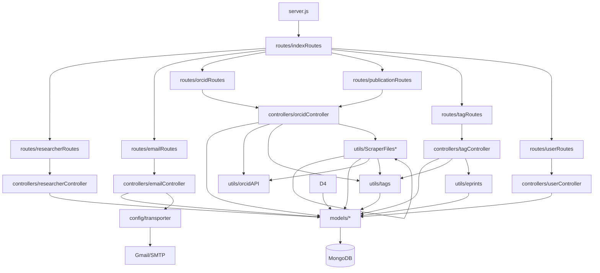
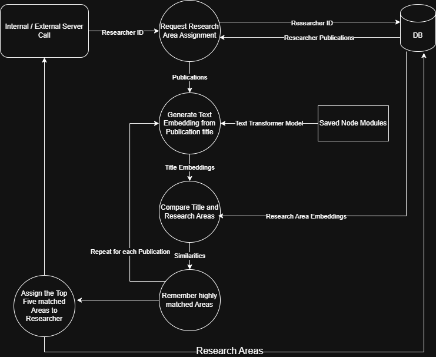

# Backend Overview

This backend is an Express.js-based REST API that manages researchers, publications, tags, users, and background data processing tasks.
It integrates with MongoDB for data persistence, Bull for background job queues, and transformer models for text embedding and similarity-based tagging.

## Contents
[Directory Overview](#directory-overview)\
[Component Interaction](#component-interaction)\
[Tag Assignment](#tag-assignment)\
[Library Overview](#library-overview)\


## Directory Overview
root/\
└── backend/\
&nbsp;&nbsp;&nbsp;&nbsp;&nbsp;&nbsp;&nbsp;&nbsp;├── assets/&nbsp;&nbsp;&nbsp;&nbsp;# Static or reference assets used by backend \
&nbsp;&nbsp;&nbsp;&nbsp;&nbsp;&nbsp;&nbsp;&nbsp;├── config/&nbsp;&nbsp;&nbsp;&nbsp;# Service initialization (e.g., DB, queues, mail)\
&nbsp;&nbsp;&nbsp;&nbsp;&nbsp;&nbsp;&nbsp;&nbsp;├── controllers/&nbsp;&nbsp;&nbsp;&nbsp;# Business logic for each route\
&nbsp;&nbsp;&nbsp;&nbsp;&nbsp;&nbsp;&nbsp;&nbsp;├── docs/&nbsp;&nbsp;&nbsp;&nbsp;# Swagger/OpenAPI documentation for REST API\
&nbsp;&nbsp;&nbsp;&nbsp;&nbsp;&nbsp;&nbsp;&nbsp;├── middleware/&nbsp;&nbsp;&nbsp;&nbsp;# Authentication, authorization, and error handlers\
&nbsp;&nbsp;&nbsp;&nbsp;&nbsp;&nbsp;&nbsp;&nbsp;├── models/&nbsp;&nbsp;&nbsp;&nbsp;# Mongoose models defining DB schemas\
&nbsp;&nbsp;&nbsp;&nbsp;&nbsp;&nbsp;&nbsp;&nbsp;├── node_modules/&nbsp;&nbsp;&nbsp;&nbsp;# Installed dependencies\
&nbsp;&nbsp;&nbsp;&nbsp;&nbsp;&nbsp;&nbsp;&nbsp;├── routes/&nbsp;&nbsp;&nbsp;&nbsp;# Route definitions mapped to controllers\
&nbsp;&nbsp;&nbsp;&nbsp;&nbsp;&nbsp;&nbsp;&nbsp;├── utils/&nbsp;&nbsp;&nbsp;&nbsp;# Helper utilities and service integrations\
&nbsp;&nbsp;&nbsp;&nbsp;&nbsp;&nbsp;&nbsp;&nbsp;├── .env&nbsp;&nbsp;&nbsp;&nbsp;# Environment variables (not committed to Git)\
&nbsp;&nbsp;&nbsp;&nbsp;&nbsp;&nbsp;&nbsp;&nbsp;├── .gitignore&nbsp;&nbsp;&nbsp;&nbsp;# Git ignore file\
&nbsp;&nbsp;&nbsp;&nbsp;&nbsp;&nbsp;&nbsp;&nbsp;├── app.js&nbsp;&nbsp;&nbsp;&nbsp;# Express app setup (middleware, routes, etc.)\
&nbsp;&nbsp;&nbsp;&nbsp;&nbsp;&nbsp;&nbsp;&nbsp;├── package-lock.json&nbsp;&nbsp;&nbsp;&nbsp;# Dependency tree metadata\
&nbsp;&nbsp;&nbsp;&nbsp;&nbsp;&nbsp;&nbsp;&nbsp;├── package.json&nbsp;&nbsp;&nbsp;&nbsp;# Project metadata and dependencies\
&nbsp;&nbsp;&nbsp;&nbsp;&nbsp;&nbsp;&nbsp;&nbsp;└── server.js&nbsp;&nbsp;&nbsp;&nbsp;# Entry point for running the Express server

## Routes Overview

`/api/` — `indexRoutes`

Top-level route router. Delegates requests to submodules.

`/api/researchers/` — `researcherRoutes`

| Route                            | Method   | Description                                                   |
| -------------------------------- | -------- | ------------------------------------------------------------- |
| `/`                              | `GET`    | Fetch all researchers                                         |
| `/:id`                           | `GET`    | Fetch researcher by MongoDB ID                                |
| `/:id`                           | `PUT`    | Update researcher by ID                                       |
| `/:id`                           | `DELETE` | Delete researcher by ID                                       |
| `/:id/tags`                      | `GET`    | Assign research areas                                         |
| `/:id/skills`                    | `GET`    | Assign technical skills                                       |
| `/:id/publications/descriptions` | `GET`    | Fetch and assign skills from Eprints                          |
| `/publications/descriptions/all` | `GET`    | Run Eprints scraping and skill assignment for all researchers |

`/api/publications/` — `publicationRoutes`
| Route       | Method | Description                            |
| ----------- | ------ | -------------------------------------- |
| `/search`   | `GET`  | Search publications by parameters      |
| `/data/:id` | `GET`  | Retrieve publication data              |
| `/all`      | `GET`  | Fetch all publications with pagination |

`/api/email/` — `emailRoutes`
| Route     | Method | Description                           |
| --------- | ------ | ------------------------------------- |
| `/email`  | `POST` | Send email with verification code     |
| `/verify` | `POST` | Verify provided code for registration |

`/api/data/` — `orcidRoutes`
| Route            | Method | Description                         |
| ---------------- | ------ | ----------------------------------- |
| `/update/:orcid` | `GET`  | Update researcher using ORCID data  |
| `/create/:orcid` | `GET`  | Create researcher via ORCID API     |
| `/start`         | `POST` | Start background ORCID scraping job |
| `/jobs`          | `GET`  | Fetch all jobs                      |
| `/jobs/:jobId`   | `GET`  | Fetch specific job                  |


`/api/tags/` — `tagRoutes`
| Route                         | Method   | Description                              |
| ----------------------------- | -------- | ---------------------------------------- |
| `/research-areas`             | `GET`    | Fetch all research areas                 |
| `/technical-skills`           | `GET`    | Fetch all technical skills               |
| `/admin/research-areas`       | `GET`    | Fetch research area metadata             |
| `/admin/technical-skills`     | `GET`    | Fetch technical skill metadata           |
| `/create`                     | `POST`   | Create new research areas or skills      |
| `/area-embeddings`            | `GET`    | Generate embeddings for research areas   |
| `/skill-embeddings`           | `GET`    | Generate embeddings for technical skills |
| `/reset-embeddings`           | `GET`    | Reset all embeddings in database         |
| `/delete`                     | `DELETE` | Delete tags from database                |
| `/all-description-embeddings` | `GET`    | Assign skills to all researchers         |
| `/all-research-areas`         | `GET`    | Assign research areas to all researchers |


`/api/users/` — `userRoutes`
| Route              | Method   | Description                    |
| ------------------ | -------- | ------------------------------ |
| `/all`             | `GET`    | Fetch all users                |
| `/login`           | `POST`   | Log in user and return JWT     |
| `/:id`             | `PUT`    | Update user by ID              |
| `/:id`             | `DELETE` | Delete user by ID              |
| `/logout`          | `POST`   | Log out current user           |
| `/change-password` | `POST`   | Change current user's password |
| `/me`              | `GET`    | Retrieve current user info     |
| `/check`           | `GET`    | Check session validity         |
| `/refresh`         | `POST`   | Refresh authentication token   |

## Component Interaction 



## Tag Assignment
### Model

All Tag assignments are handled by functions in [/utils/tags.js](./utils/tags.js). 

Tags are assigned using an imported [Xenova Text Transformer](https://huggingface.co/Xenova/all-MiniLM-L6-v2) (all-MiniLM-L6-v2):

**Input**

Words / Sentences
- Accepts text inputs of up to 256 words (longer inputs are truncated)


**Output**

Text Embeddings
- 384-dimensional vector that represents the semantic meaning of the input text

[More info on the model](https://www.aimodels.fyi/models/huggingFace/all-minilm-l6-v2-xenova)

**Use**

- We use these embeddings to compare the semantic meanings of different inputs, using cosine similarity

**Sample Use**

Title: *Whole-body imaging with single-cell resolution by tissue decolorization*

Embedding: <details>
```js
[-0.053931981325149536, 0.04892561584711075, 0.08663436770439148, 0.11023857444524765, 0.02131219394505024, -0.004869583994150162, 0.0676804631948471, -0.027282781898975372, 0.04203884303569794,..., '375 more']
```
<summary>*Float32Array(384)*</summary>
 </details>


### Process
The process is very similar for both Research Areas and Technical Skills assignment. After loading the required resources, the provided dataset is iterated through, the tag assignment function identifies similarities to loaded tags from the DB, and the highest matches are assigned to the researcher. 

**Init**

On startup (first tag assignment in session) a pipeline to the Text Transformer model is loaded, and the pre-calculated tag embeddings and names are loaded from their repective collection in the database into arrays, like below.
```js
let research_areas = ['Biology', 'Business'...]; 
let areas_embeddings = [Float32Array(384), Float32Array(384),...];

let technical_skills = ['Clinical NLP (MedSpaCy)', 'Logistic regression'...]; 
let skills_embeddings = [Float32Array(384), Float32Array(384),...];
```

**Process**

The specific tag assignment method is called from one of the controller.js files ([see component interaction](#component-interaction) and [routes](#routes-overview)), and the supplied publication data is looped iterated through. 

For each publication, the embedding is generated and compared to the pre-loaded tag embeddings, with the similarities that exceed the threshold *(0.1)* stored in a Map.

At the end, the 5 highest matches are assigned to the Researcher in the DB. 

### Examples

`Research Area Assignment Example Data Flow` 

.
    


## Library Overview

| Library                   | Purpose                                               | Link                                                                                    |
| ------------------------- | ----------------------------------------------------- | --------------------------------------------------------------------------------------- |
| **@xenova/transformers**  | Run text transformers in Node.js for semantic tagging | [npmjs.com/@xenova/transformers](https://www.npmjs.com/package/@xenova/transformers)    |
| **axios**                 | Make HTTP requests to external APIs                   | [axios-http.com](https://axios-http.com/)                                               |
| **bcryptjs**              | Hash and compare passwords                            | [npmjs.com/bcryptjs](https://www.npmjs.com/package/bcryptjs)                            |
| **bull**                  | Background job queue using Redis                      | [npmjs.com/bull](https://www.npmjs.com/package/bull)                                    |
| **cheerio**               | Server-side HTML parsing/scraping                     | [cheerio.js.org](https://cheerio.js.org/)                                               |
| **cookie-parser**         | Parse cookies in Express                              | [npmjs.com/cookie-parser](https://www.npmjs.com/package/cookie-parser)                  |
| **cors**                  | Handle Cross-Origin Resource Sharing                  | [github.com/expressjs/cors](https://github.com/expressjs/cors)                          |
| **cosine-similarity**     | Compute vector similarity for embeddings              | [npmjs.com/cosine-similarity](https://www.npmjs.com/package/cosine-similarity)          |
| **crypto**                | Encryption and hashing utilities                      | [nodejs.org/api/crypto.html](https://nodejs.org/api/crypto.html)                        |
| **dotenv**                | Load environment variables                            | [github.com/motdotla/dotenv](https://github.com/motdotla/dotenv)                        |
| **email-validator**       | Validate email formats                                | [npmjs.com/email-validator](https://www.npmjs.com/package/email-validator)              |
| **express**               | Web server framework                                  | [expressjs.com](https://expressjs.com/)                                                 |
| **express-async-handler** | Simplify async error handling                         | [npmjs.com/express-async-handler](https://www.npmjs.com/package/express-async-handler)  |
| **http-errors**           | Generate HTTP error responses                         | [npmjs.com/http-errors](https://www.npmjs.com/package/http-errors)                      |
| **jsonwebtoken**          | JWT-based authentication                              | [github.com/auth0/node-jsonwebtoken](https://github.com/auth0/node-jsonwebtoken)        |
| **mongodb**               | MongoDB driver for Node.js                            | [mongodb.github.io/node-mongodb-native](https://mongodb.github.io/node-mongodb-native/) |
| **mongoose**              | Object modeling for MongoDB                           | [mongoosejs.com](https://mongoosejs.com/)                                               |
| **mongoose-paginate-v2**  | Pagination for Mongoose queries                       | [npmjs.com/mongoose-paginate-v2](https://www.npmjs.com/package/mongoose-paginate-v2)    |
| **morgan**                | HTTP request logger                                   | [npmjs.com/morgan](https://www.npmjs.com/package/morgan)                                |
| **nodemailer**            | Send emails (Gmail, SMTP, etc.)                       | [nodemailer.com](https://nodemailer.com/)                                               |
| **p-limit**               | Limit concurrency of async functions                  | [npmjs.com/p-limit](https://www.npmjs.com/package/p-limit)                              |
| **swagger-ui-express**    | Serve Swagger documentation                           | [npmjs.com/swagger-ui-express](https://www.npmjs.com/package/swagger-ui-express)        |
| **xml2js**                | Parse XML to JSON (used for Eprints data)             | [npmjs.com/xml2js](https://www.npmjs.com/package/xml2js)                                |
