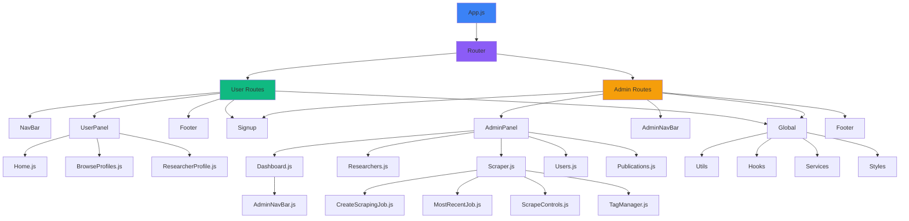

# Frontend Overview

This frontend is a React-based single-page application (SPA) that provides an interface for browsing researchers, visualizing research networks, and managing data through an admin panel. It integrates with the Express.js backend API for data persistence and authentication.

## Contents
[Directory Overview](#directory-overview)\
[Component Interaction](#component-interaction)\
[Routing Structure](#routing-structure)\
[Key Features](#key-features)\
[Library Overview](#library-overview)

## Directory Overview

```
research-app/
└── src/
    ├── components/          # Reusable UI components
    │   ├── adminComponents/ # Admin-specific components
    │   ├── global/          # Shared components (Footer, DarkMode, etc.)
    │   ├── userComponents/  # User-facing components
    │   └── utils/           # Utility components (Pagination, etc.)
    ├── hooks/               # Custom React hooks
    ├── pages/               # Page-level components
    │   ├── admin/           # Admin panel pages
    │   └── users/           # User-facing pages
    ├── services/            # API service layer
    ├── App.js               # Main application component with routing
    ├── App.css              # Global styles
    └── index.js             # Application entry point
```

### Key Directories

**`/components`** — Reusable UI components organized by context

- **`adminComponents/`** — Admin dashboard components for managing researchers, tags, and scraping jobs
- **`userComponents/`** — Public-facing components for browsing and visualizing research data
- **`global/`** — Shared components used across both admin and user interfaces
- **`utils/`** — Helper components like pagination and network data builders

**`/pages`** — Top-level page components that compose smaller components

- **`admin/`** — Administrative interface pages
- **`users/`** — Public user interface pages

**`/services`** — API client layer that communicates with the backend

**`/hooks`** — Custom React hooks for state management and side effects

**`/utils`** — Helper functions for network graph building and configuration

## Routing Structure

The application uses React Router v6 with two main route contexts:

### User Routes (`/*`)
Accessible to all users. Provides research browsing and network visualization.

| Route | Component | Description |
|-------|-----------|-------------|
| `/` | `Home.js` | Landing page with hero section and research network visualization |
| `/login` | `Signup.js` | Combined login/signup page with email verification |
| `/researchers` | `BrowseProfiles.js` | Browse researchers with filtering by research areas and skills |
| `/researchers/:id` | `ResearcherProfile.js` | Individual researcher profile with publications |
| `/edit-profile` | `EditProfile.js` | Edit user profile (research areas, skills, contact info) |
| `/logout` | `Logout.js` | User logout |
| `*` | `NotFound.js` | 404 page |

### Admin Routes (`/admin/*`)
Requires authentication and admin privileges. Protected routes for administrative functions.

| Route | Component | Description |
|-------|-----------|-------------|
| `/admin` | `Dashboard.js` | Admin overview with statistics and quick actions |
| `/admin/researchers` | `Researchers.js` | Manage researchers (CRUD operations) |
| `/admin/users` | `Users.js` | Manage user accounts and permissions |
| `/admin/publications` | `Publications.js` | View and manage publications |
| `/admin/data` | `Scraper.js` | Data scraping manager with tabs for dashboard, create job, logs, and tags |

## Component Interaction

The following diagram shows how components are organized and interact:



## Key Features

## Library Overview
